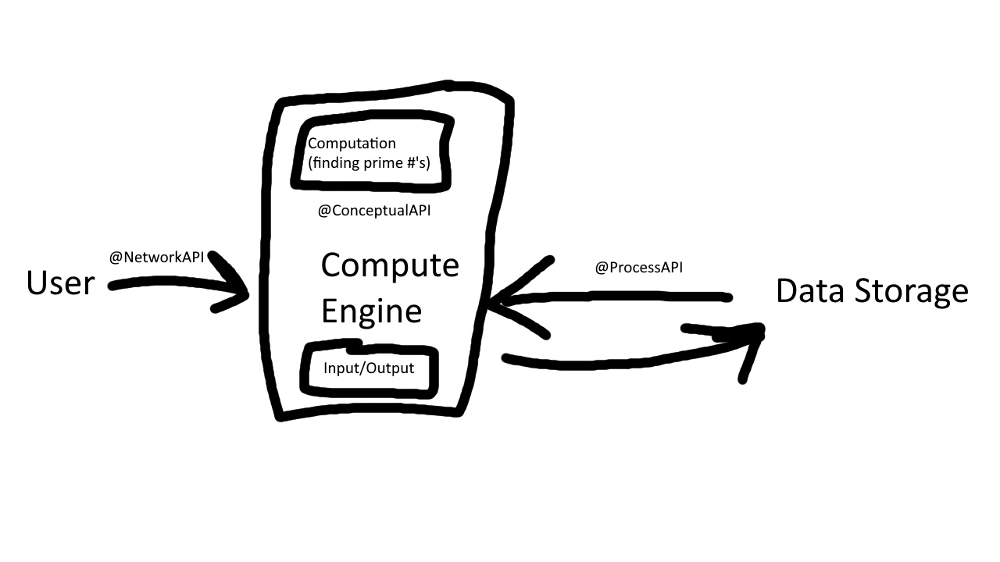

# Software Engineering Project Starter Code

[Part 1]:

The computation my system will be running is finding all of the prime integers from the
user's given input. (ex: an input of 20 will return 2, 3, 5, 7, 11, 13, 17, and 19)

[Part 2]:
